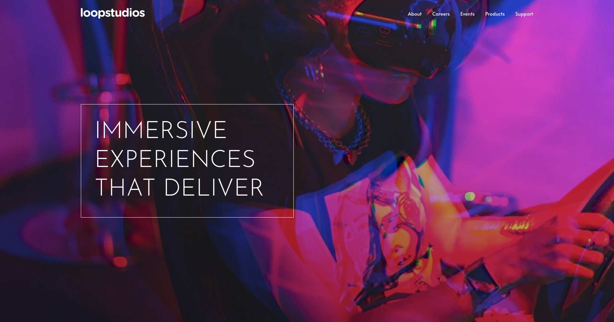

    

# Loopstudios Landing Page

### 👋 Hello there 

This is a Landing Page project that I've build using the designs from the <a href="https://frontendmentor.io">FrontendMentor<a> website. I believe that it was a helpful experience that gave me more practice working with Css and Javascript.

## 👨‍💻 Table of contents

- [Overview](#-overview)
  - [Screenshot](#screenshot)
  - [Live website](#live-website)
- [My process](#-my-process)
  - [Built with](#built-with)
- [Contact](#-contact-me)

## 🔭 Overview

### Screenshot

### Live website

Check out the Live version of this project: <a href="https://mariushor.github.io/loopstudios-landing-page-main/">Loopstudios Landing Page<a>

## 🚀 My process

### Built with

- HTML5
- CSS3
- SASS
- JavaScript
- Webpack
- BEM
- FontAwesome
- Autoprefixer
- EsLint
- Prettier 

## 📫 Contact me 

- marius.horghidan@yahoo.com
